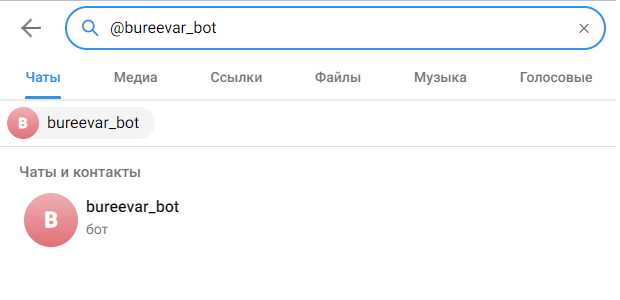
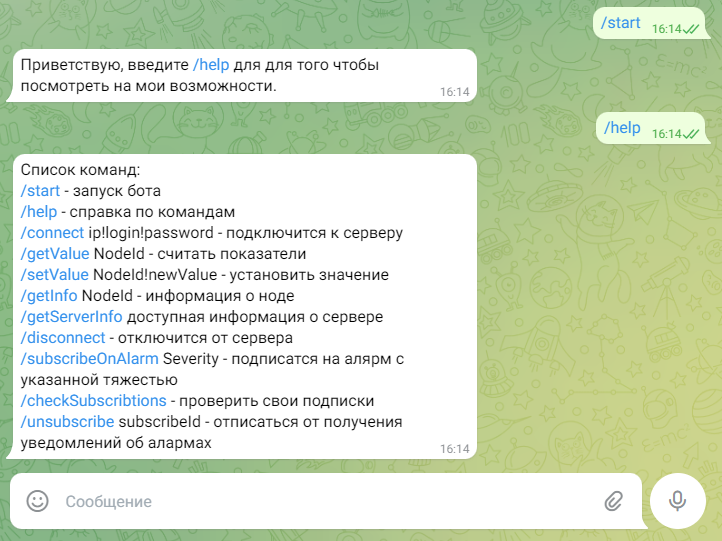
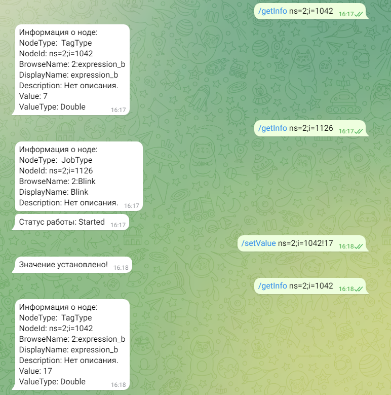
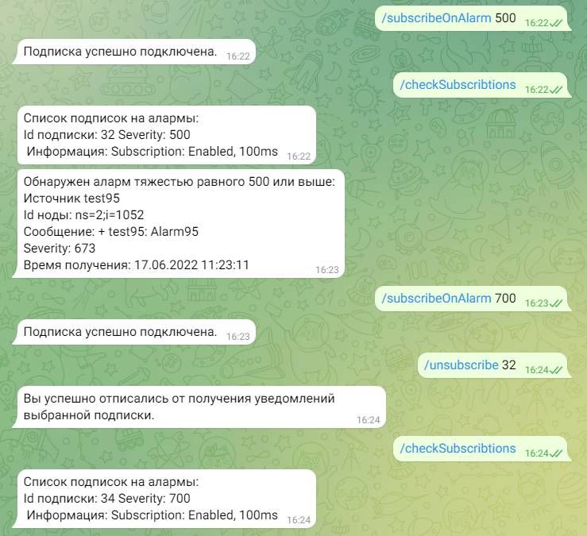

# Пользовательская документация
Программа TelegramOpcuaBot представляет собой телеграм-бота, который способен связавшись с сервером через протокол OPC UA обрабатывать ряд запросов пришедших к нему от пользователя.
Данное приложение поможет вам дистанционно просматривать информацию и изменять значения нод, подписываться на уведомдления об алармах в соответствии с их тяжестью (severity) получать оповещения об произошедших алармов, просматривать информацию о сервере
## Запуск бота
Для того чтобы запустить бота необходимо в приложении или в web-версии Telegram в поиске вписать имя своего бота (напр. @bureevar_bot) и найдя его в разделе "Чаты и контакты". Далее нажав на него, откроется чат где можно вписывать ему команды. В случае каких-либо проблем сперва попытайтесь проверить подключение к интернету, обновить телеграм, проверить состояние сервера.


## Функции телеграм бота

### Запуск и просмотр функционала
Для начала пропишите команду 
```sh
/start
```
В результате бот поприветствует вас и предложит ввести следующую команду:
```sh
/help 
```
Данная команда служит краткой подсказкой пользователю о том на какие команды бот умеет реагировать.

### Подключение к серверу
Чтобы подключится к серверу необходимо знать IP сервера, а так же свой логин и пароль в нем. Не подключенный к серверу пользователь не сможет воспользоватся услугами бота.
Для подключения к серверу введите следующую команду:
```sh
/connect ip!login!password
```
IP сервера, логин и пароль вводятся через знак "!" (напр. `opc.tcp://127.0.0.1/!admin!123`) в случае если пароля нет, то после ввода логина также пишется "!" (напр. `opc.tcp://127.0.0.1/!admin!`)
В случае успешного подключения бот уведомит вас об этом.
### Отключение от сервера
Для того чтобы отключится от сервера пользователь должен ввести следующую команду.
```sh
/disconnect
```
Об успешном выполнении команды будет так же сообщено. Следует помнить что если вы отключились от сервера, ваши подписки на алармы обнуляются и в следующий раз придется снова подписываться на них чтобы получать уведомления.
### Считывание значения с ноды
Для того чтобы считать значение с ноды необходимо прописать следующую команду:
```sh
/getValue NodeId
```
Вместо `NodeId` необходимо вписать id интересующей ноды (напр. `/getValue ns=2;i=1042`). Важно понимать, что данная команда не сможет получить значение от ноды которая не типа TagType, т.е не является тэгом и в случае чего сообщит вам об этом.

### Установка значения ноде
Для того чтобы установить значение той или иной ноде необходимо ввести следующую команду:
```sh
/setValue NodeId!newValue
```
Параметрами данной команды будут id ноды (`NodeId`) а так же значение ноды (`newValue`), на которое вы хотите сменить текущее значение. Пример команды с параметрами представлен ниже:
```sh
/setValue ns=2;i=1042!17
```
Как и с предыдущим пунктом, значения ноды изменять можно только тэгам (TagType), однако помимо этого если вы присвоете неверный тип данных к ноде, тогда операция будет отменена (например когда пытаешься ноде со значением типа Double присвоить значение `текст~string`).

Для предотвращения таких ситуаций сначала стоит посмотреть информацию о ноде (след. пункт).
### Просмотр информации о ноде
Просмотр информации о ноде осуществляется следующим образом (см. команду ниже):
```sh
/getInfo NodeId
```
Параметрами данной команды является id ноды (напр. `/getInfo ns=2;i=1042`). В случае если нода является тэгом, то бот дополнительно введет значение ноды, а если тип `JobType`, т.е работа, тогда выведет состояние работы.

Ниже приведен скриншот где были произведены некоторые действия с ботом:

### Просмотр информации о сервере
Для того чтобы посмотреть информацию о сервере следует ввести следующую команду:
```sh
/getServerInfo
```
### Настройка подписки на алармы
Алармы представляют собой важные сообщения о каких-либо ошибках/происшествиях. Чтобы подписаться на аларм необходимо ввести ввести следующую команду, введя в параметры число severity (тяжести) начиная с которого будут приходить уведомления:
```sh
/subscribeOnAlarm Severity
```
```sh
/subscribeOnAlarm 700 
```
Последняя команда устанавливала подписку на алармы начиная с 700 severity.

Чтобы посмотреть свои подписки на алармы следует ввести команду:
```sh
/checkSubscribtions
```
Здесь показана базовая информация о подписке, атрибут id пригодится далее для того чтобы от нее отписаться

Чтобы отписаться от той или иной подписки необходимо ввести следующую команду
```sh
/unsubscribe subscribeId
```
```sh
/unsubscribe 25
```
Здесь `subscribeId` это id подписки, которые можно узнать посмотрев информацию о подписках.

Ниже представлен скриншот работы с алармами: 

## Вероятные ошибки и их причины
- Если введены корректные данные для подключения, но бот сообщает об обратном то скорее всего сервер выключен и программа просто не может к нему подключиться.

- Если не получается установить значение ноде, то скорее всего или неверно введена нода или нода не является тэгом а значит и не имеет значения.

- Если бот не реагирует на ввод то скорее всего или устройство отключено от интернета или само приложение не запущено.
## Поддержка
Если у вас возникли сложности или вопросы по использованию бота, напишите на электронную почту 
bureevart@gmail.com

